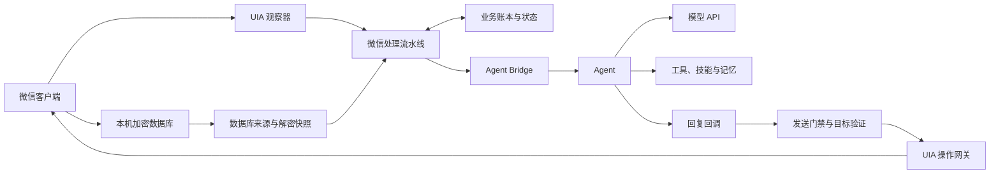
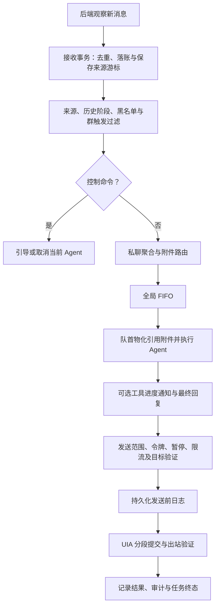

# fake-wx-account

基于 [CowAgent](https://github.com/zhayujie/CowAgent) 的 Windows 微信桌面 Agent。项目把微信消息接收、自动回复队列、模型与工具调用、界面发送连接起来，并提供本地 Web 控制台。

适配目标为微信 **4.1.9.30**；本机开发环境为 **Python 3.13.11 x64 / Conda `cowagent-wechat`**。当前支持两种微信后端：默认 `uia`，以及可显式启用的 `db_uia`。两者都通过微信界面发送消息。

## 微信后端与能力

| 能力 | `uia` | `db_uia` |
| --- | --- | --- |
| 实时消息来源 | UIA 会话列表与聊天气泡 | 本机加密数据库 |
| 接收唤醒 | Shell Hook、读取失败重试；可启用定时校准 | 默认每 1 秒轮询数据库变化 |
| 接收是否需要操作聊天窗口 | 可能定位、切换会话并读取可见气泡 | 数据库观察无需切换聊天窗口或执行 OCR |
| 群发送者 | UIA 文本与可选 RapidOCR | 消息分片中的原生发送者映射 |
| 联系人检索 | 未提供数据库检索能力 | 按昵称、备注、微信号等检索，返回稳定会话 ID |
| 历史查询 | 当前会话的独立聊天记录窗口 | 按稳定 ID 查库；省略 ID 时先读取当前界面标题 |
| 引用与附件 | 一层原文定位、图片查看器、文件下载与缓存 | 可解析引用文本及类型；原生消息与 UIA 附件气泡尚未可靠关联 |
| 消息发送 | UIA 定位、提交及出站气泡验证 | 数据库身份与 UIA 目标绑定后，通过同一 UIA 网关发送 |

`db_uia` 以数据库作为唯一实时接收来源。数据库故障时保留游标并重试，暂停新事件交付；不会自动改用 UIA 接收。发送、联系人和历史查询的具体边界见下文。

## 快速运行

在项目根目录使用 PowerShell。所有 Python 命令必须显式使用本项目解释器，首次执行先确认路径：

```powershell
D:\Miniconda\envs\cowagent-wechat\python.exe -c "import sys; print(sys.executable)"
D:\Miniconda\envs\cowagent-wechat\python.exe -m pip install -r .\requirements-windows.txt
```

输出应为 `D:\Miniconda\envs\cowagent-wechat\python.exe`。环境不存在时，用 `D:\Miniconda\Scripts\conda.exe env list` 检查；其他工作站应使用自己 `cowagent-wechat` 环境的绝对解释器路径。

仅在根配置文件不存在时复制模板，随后配置模型、Agent 和通道：

```powershell
if (-not (Test-Path -LiteralPath .\config.json)) {
    Copy-Item .\config-template.json .\config.json
}
```

根 `config.json` 通过下列通用项启用 Web 和桌面微信：

```json
{
  "channel_type": "web,wechat_desktop"
}
```

保持微信已登录，并按下一节设置通道行为。项目管理命令为：

```powershell
.\cow.ps1 start
.\cow.ps1 status
.\cow.ps1 stop
.\cow.ps1 restart
```

启动在当前终端前台运行，默认控制台地址为 <http://127.0.0.1:9899/chat>。也可直接执行：

```powershell
D:\Miniconda\envs\cowagent-wechat\python.exe .\app.py
```

`cow.ps1` 从 Conda 中查找固定名称的环境；端口检查使用 9899。修改微信 `config.py` 后需重启整个 `app.py` 进程，网页重连或单独重建通道不会重新加载已经导入的配置模块。

## 配置归属与当前行为

| 配置层 | 唯一来源 | 内容 |
| --- | --- | --- |
| 全局 / Agent | `config.json`；字段模板为 `config-template.json` | 模型、厂商、Agent 工作区、通道启用、Web、通用工具与技能 |
| 微信通道 | [channel/wechat_desktop/config.py](channel/wechat_desktop/config.py) 的 `DEFAULT_CONFIG` | 后端、数据库路径、白名单、群触发、影子模式、节拍、限流、引用和通知策略 |
| 厂商密钥 | `~/.cow/.env` | 先加载环境变量，再按对应能力读取；配置字段仅作可选回退 |

根 JSON 不放 `wechat_desktop` 段或微信业务键。根 `config.py` 负责加载通用配置，不维护微信业务默认值。真实 API Key、微信数据库密钥和聊天内容不进入仓库。

当前仓库的通道默认值如下，首次联调前应明确选择发送范围：

| 字段 | 当前值 | 行为 |
| --- | --- | --- |
| `desktop_backend` | `"uia"` | 使用界面接收，不自动启用数据库解密 |
| `shadow_mode` | `False` | 允许正式发送 |
| `auto_reply_private_all` | `True` | 全部私聊通过发送范围检查 |
| `auto_reply_groups_all` | `True` | 全部群通过发送范围检查，群白名单不限制范围 |
| `group_reply_mode` | `"at_only"` | 群消息仍需满足 @ 触发 |
| `shell_hook_reconcile_enabled` | `False` | UIA 当前未启用定时校准兜底 |
| `db_poll_interval_seconds` | `1.0` | 数据库模式轮询间隔 |

群白名单已包含“816吃喝玩乐群”。若希望仅名单中的群允许发送，将 `auto_reply_groups_all` 改为 `False`；黑名单的优先级高于全部放行与白名单。

以下是**首次受控验证的配置示例**，写入通道 `DEFAULT_CONFIG`，按需要保留其他现有名单：

```python
"desktop_backend": "db_uia",
"shadow_mode": True,
"auto_reply_private_all": False,
"auto_reply_groups_all": False,
"auto_reply_contacts": [],
"auto_reply_groups": ["816吃喝玩乐群"],
"group_reply_mode": "at_only",
"db_data_dir": "",
"db_account": "",
"db_poll_interval_seconds": 1.0,
"db_cache_dir": "",
```

发送白名单与影子模式主要在发送阶段检查；非名单消息仍可能被落账、解析或送入 Agent。会话/发送者黑名单和群触发规则则在扫描路由前过滤。`shadow_mode=True` 禁止发送，数据库专用影子诊断还会跳过整个 Agent 回复流程。

## 项目架构

```text
app.py                         多通道启动与生命周期
channel/web/                   本地控制台
channel/wechat_desktop/
  config.py                    微信业务配置
  backend.py                   后端公共接口与创建工厂
  models.py / contracts.py     事件、接收回执、目标与发送结果
  conversation.py              共享标题匹配规则
  hybrid.py                    数据库来源与 UIA 网关的组合
  binding.py                   数据库身份到界面目标的账号/会话绑定
  pipeline/                    接收、聚合、物化、FIFO、Agent 回调与发送门禁
  db/                          账号定位、只读密钥获取、解密缓存与原生消息解析
  uia/                         窗口操作、可选界面接收、发送和附件获取
  storage/                     业务账本、来源游标、发送去重与运行状态
bridge/                        通道到模型和 Agent 的适配
agent/                         Agent 执行、工具、技能、记忆与知识库
models/                        模型厂商与 API 客户端
skills/                        项目技能及启用配置
scripts/                       只读诊断与开发辅助
```



图中的两条接收路径按后端配置选择，每次只启用一个。组件职责为：

| 组件 | 负责的事情 |
| --- | --- |
| `db/source.py` | 账号生命周期、固定启动基线、每个来源流的分页与待 ACK 批次 |
| `db/reader.py` 与 `db/cache.py` | 库结构识别、正文解析、认证解密快照及 WAL 刷新 |
| `uia/driver.py` | 默认 UIA 后端的界面观察、消息身份协调和事件转换 |
| `uia/gateway.py` | 共享 UI 操作租约、定位、文本/图片发送；不创建接收扫描状态 |
| `binding.py` | 核验数据库账号与微信窗口，映射稳定会话 ID，拒绝歧义或失效绑定 |
| `hybrid.py` | 组合数据库接收、数据库查询和 UIA 操作 |
| `pipeline/` | 路由、私聊聚合、附件物化、严格 FIFO、Agent 执行及发送门禁 |
| `storage/store.py` | 接收事务、历史、来源去重与游标、发送前日志和审计 |

数据库读取层不依赖 UIA；组合层通过公开接口协调两种来源。详细目录、锁与接口契约见 [微信通道架构说明](channel/wechat_desktop/ARCHITECTURE.md)。

## 自动回复流程



1. **观察与可靠接收。** 后端生成统一事件。UIA 逐事件持久化成功后 ACK；数据库模式将来源去重、事件、过滤记录、历史和各来源游标一起提交，成功后才 ACK 批次。存储失败会重交付；已落账的重复消息不再次路由。
2. **决定是否回复。** 数据库系统消息和出站消息只保存来源过滤记录。历史基线、离线补读默认不回复；会话或发送者黑名单、来源类型和群触发不满足时结束路由。UIA 的 @ 判断依赖界面会话提示与正文，数据库模式依据原生消息元数据解析。
3. **聚合与附件准备。** 私聊在回复与物化闲置时可开启滑动聚合窗口，默认静默等待 500–1200 毫秒，最长 4000 毫秒；群聊直接提交。独立图片和分享卡片只记录身份，独立文件按可用后端缓存，不自动回复。文字不会隐式继承此前未引用的附件。
4. **进入 FIFO。** 回复按实际入队顺序追加，由单消费者处理。已排队或正在执行的任务不会被新消息替换。引用附件的实际定位与物化可延迟到队首；该顺序不等于所有会话的原生时间戳全局排序。
5. **运行 Agent。** 通过 Bridge 构建当前会话上下文，模型可调用工具、技能、记忆与知识库。真正开始调用可见工具/技能时可发进度提示，默认每个回复周期一次；内部工具可静默。引用只追溯一层。
6. **验证并发送。** 最终回复和进度提示都检查队列令牌、停止/暂停、影子模式、黑白名单及额度。按实际气泡数预留配额并写发送前日志，再校验目标、通过 UIA 提交。每个 UI 段保留取消检查；拟人化节拍在 UI 租约之外等待。
7. **收尾与恢复。** 记录已提交/已验证分段、审计和终态。默认回复周期为 180 秒，超时令牌失效并取消 Agent，迟到结果拒绝发送。`partial`、`uncertain` 和 `unverified` 不自动重发；进程重启将旧未完成任务收尾为 `interrupted` 或 `uncertain`，不恢复自动回复队列。

`/cancel` 和 `/steer <指令>` 绕过聚合、附件物化与 FIFO，直接取消或引导当前 Agent，但仍需通过来源、黑名单和群触发检查。

## 微信本地数据库：何时解密

### 读取范围与账号绑定

自动发现当前账号 `xwechat_files/.../db_storage/` 下的以下库：

| 数据库 | 用途 |
| --- | --- |
| `contact.db` | 联系人、群聊名称及稳定会话身份映射 |
| `message_<数字>.db` | 消息正文、方向、发送者、@、一层引用和历史 |
| `session.db` | 辅助确认启动未读数量与首条未读边界 |

当前自动发现不接入 `sns.db`、朋友圈或媒体文件解密。数据库只覆盖已经同步到本机的消息，不能代表完整服务端历史。

空 `db_data_dir` 自动定位本机数据目录；空 `db_account` 只在能唯一认证当前登录账号时使用。多账号无法唯一确定时返回明确错误，应指定目录与账号。绑定账号在运行期间固定；同账号重登录会重新建立读取器，不同账号则暂停并要求重新绑定。

### 操作与解密时机

`db_uia` 的构造只建立来源和绑定对象。**第一次实际需要数据库数据时**才创建读取器；正常启动后，首轮数据库观察会触发这一过程。

| 操作 | 数据库行为 | UIA 行为 | 是否推进实时接收游标 |
| --- | --- | --- | --- |
| 默认 `uia` 接收或发送 | 不创建数据库读取器 | 使用界面观察与操作 | 不涉及数据库来源游标 |
| `db_uia` 首次观察 | 认证账号、获取密钥、首次刷新全量解密 | 不初始化 UIA 网关 | 初始化固定基线；收到批次后随接收事务提交 |
| 后续数据库轮询 | 检查变化，按需刷新快照和分页 | 无需窗口切换或 OCR | 仅随成功提交的接收批次推进 |
| 联系人检索 | 必要时初始化，刷新联系人快照 | 无需 UIA | 否 |
| 按稳定 ID 查询历史 | 刷新快照，再查询指定会话 | 无需 UIA | 否 |
| 查询当前会话历史 | 刷新快照，再查询对应会话 | 读取当前标题并核验账号，唯一映射到数据库 ID | 否 |
| `db_uia` 发送/目标验证 | 刷新联系人；自动回复还复核原生消息 | 校验窗口、账号、RuntimeId、标题和选中状态后发送 | 否 |
| 数据库诊断脚本 | 显式初始化与解密，即使默认后端仍是 `uia` | 只有指定 `--benchmark-uia` 才读取 UIA 历史作对比 | 独立影子账本，不改业务游标 |

联系人和历史查询不投递入站事件、不触发自动回复，也不将查询结果写入业务会话历史。它们可以刷新解密快照，但不会 ACK 实时消息。

### 密钥与快照的生命周期

1. **初始化账号与密钥。** 只读扫描已登录微信进程中的候选密钥，以数据库首页面 HMAC 认证账号，并取得各库的有效密钥。逐库密钥通过 Windows DPAPI 保存；新账号生命周期仍需认证进程与账号，密钥缓存不免除这一步。
2. **首次全量解密。** 校验主库每页 HMAC，使用 AES 解密，合并通过校验且已提交的 WAL，生成可只读查询的 SQLite 明文快照，并进行结构与完整性检查。正文压缩数据使用 `zstandard` 解析。
3. **空闲轮询。** 检查主库、WAL 和共享内存中的状态。无变化时不重新解密、不重建缓存，也不执行 OCR；正常轮询不重复全进程内存扫描。
4. **WAL 增量。** 同一 WAL 世代只处理新增有效帧，校验头/帧校验和、salt、页 HMAC 和 `-shm` 提交边界。未提交事务不对外发布；已提交页应用到私有快照。
5. **需要重建。** checkpoint 将 WAL 页面回写主库、WAL 重置/截断、数据库替换或读取器重建时，重新建立完整快照。每个读取器使用独立缓存文件，**项目进程重启后首次读取仍会全量解密**。
6. **刷新失败。** 保留最后验证成功的副本，标记陈旧并暂停新事件交付，游标不前进。恢复后继续重试；库来源代次异常、账号变化或密钥错误会明确报告。

刷新快照时按 SQLite 的 WAL 锁协议获取共享锁，以避开提交/checkpoint 交错；全量重建时持锁时间随库规模增加，锁忙则重试。此过程不写微信进程内存或原始数据库。

### 三类本地数据

| 数据 | 默认位置 | 作用与保留 |
| --- | --- | --- |
| 微信原始库 | 微信账号的 `db_storage/` | 微信自身维护的加密库，仅只读访问 |
| 解密缓存与密钥 | `<agent_workspace>/wechat_desktop_db/<account_id>/` | `snapshots/` 保存私有明文副本，正常关闭删除；`keys/` 保存 DPAPI 加密密钥 |
| 业务账本 | `<agent_workspace>/wechat_desktop.sqlite3` | 保存接收记录、历史、过滤、来源游标、任务与发送日志，跨进程恢复接收状态 |

`db_cache_dir` 可覆盖缓存根目录。缓存按账号隔离，Windows ACL 限当前用户与系统访问。**DPAPI 加密的是密钥；解密快照和账本包含聊天明文。** 更换 Windows 用户或机器后需要重新获取密钥。

每个来源流按账号、分片、消息表独立保存游标；消息身份使用原生主键组合，显示名、正文和屏幕坐标不参与数据库消息去重。首次启动固定历史高水位；重启补读只补账本和历史，只有能证明启动未读边界时才应用启动未读回复配置。

## 查询历史、发送绑定与附件边界

Agent 可通过 `wechat_desktop` 检索联系人：

```json
{"action": "search_contacts", "query": "816吃喝玩乐群", "limit": 20}
```

再将返回的原始 `conversation_id` 交给 `wechat_history`：

```json
{"conversation_id": "使用检索返回的稳定会话ID", "limit": 20}
```

省略 ID 时仍表示查询当前打开会话。默认 20 条，上限 50 条；数据库结果包含方向、发送者、原生时间、消息 ID 和来源。纯 `uia` 模式不支持联系人检索或按数据库 ID 查询，返回 `capability_unavailable`。

数据库会话 ID 本身不等于已验证的发送目标。`binding.py` 将其绑定到实际窗口进程、账号与会话 RuntimeId；同名歧义、账号不一致或失效绑定会拒绝发送。界面未提供对方原生身份时明确记录为 `display_name` 验证。每段发送都会复核，关闭或重登录后旧发送调用不能在恢复时继续提交。

UIA 后端可使用一层原文定位、图片查看器和文件下载。数据库后端目前不能可靠关联原生消息与 UIA 气泡，相关附件标记为 `uia_identity_unavailable`，保留类型/来源及降级信息，不猜测归属后下载。图片/文件能力因此不能直接视为两个后端共有。

## 诊断与开发验证

数据库只读诊断命令：

```powershell
D:\Miniconda\envs\cowagent-wechat\python.exe scripts\wechat_db_doctor.py --schema
D:\Miniconda\envs\cowagent-wechat\python.exe scripts\wechat_db_doctor.py --shadow-seconds 60
```

需要明确账号时追加 `--data-dir "数据目录" --account "账号目录名"`；`--cache-dir` 可指定缓存位置。`--shadow-seconds` 使用独立的 `validation/shadow-ledger.sqlite3` 落账，不进入 Agent 或发送流程；输出结构、计数、健康、稳定 ID、CPU/I/O 和耗时，不输出密钥或聊天正文。诊断账本仍可能包含聊天明文。

如需对比当前可见会话的 UIA 读取，可显式增加 `--benchmark-uia`。该项可能执行群发送者 OCR；一次历史查询耗时不代表持续接收的资源开销。

UIA 与会话控件诊断命令：

```powershell
D:\Miniconda\envs\cowagent-wechat\python.exe scripts\test_wechat_uia.py --standard-targets
D:\Miniconda\envs\cowagent-wechat\python.exe scripts\dump_wechat_conversation_tree.py --output .\tmp\wechat-conversations.json
```

控件树报告可能包含会话名称与消息预览。向外分享前去除真实聊天信息；只读诊断不需要实际发送参数。

开发回归使用合成加密库、临时 SQLite/WAL 和 UIA 替身：

```powershell
D:\Miniconda\envs\cowagent-wechat\python.exe -m pytest tests/wechat_desktop tests/test_wechat_desktop.py tests/test_wechat_desktop_robustness.py tests/test_baidu_ai_search.py -q
```

数据库状态重点查看 `db_read_healthy`、`db_read_stale`、`db_read_last_success_at`、`db_read_error_code`、`account_binding` 和各来源 `db_read_backlog`。数据库读取健康与 UIA 目标已验证是两个独立条件。

已有单机只读验证记录及性能数据见 [数据库后端说明](docs/wechat-db-backend.md)。受控新入站消息、真实 WAL 追加逐条落账与无重复还需实际消息验收；合成测试通过不能替代这一过程。

## 上游与许可证

Agent、模型、工具与通用能力来自 [CowAgent](https://github.com/zhayujie/CowAgent)，通用使用说明见 [CowAgent 文档](https://docs.cowagent.ai/)。

微信数据库格式参考 `wechatauto-replica` 的固定提交，来源与范围记录在 [db/NOTICE](channel/wechat_desktop/db/NOTICE)，对应 Apache 2.0 许可证保留在 [UPSTREAM_LICENSE.txt](channel/wechat_desktop/db/UPSTREAM_LICENSE.txt)。项目未安装其完整自动化包；解密使用现有 `pycryptodome`，压缩正文使用 Windows 依赖中的 `zstandard==0.25.0`。

项目主体沿用 CowAgent 的 [MIT License](LICENSE)。
